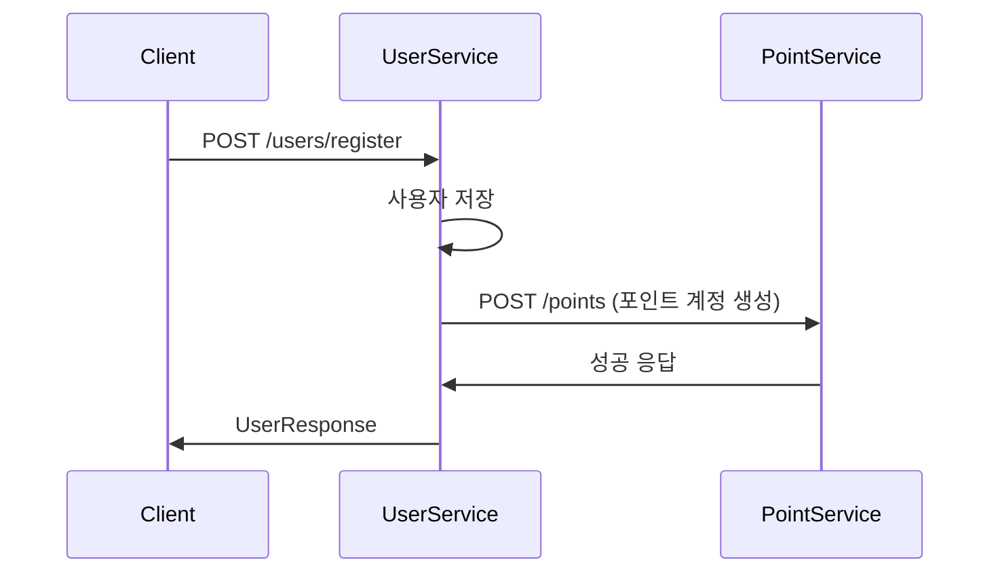
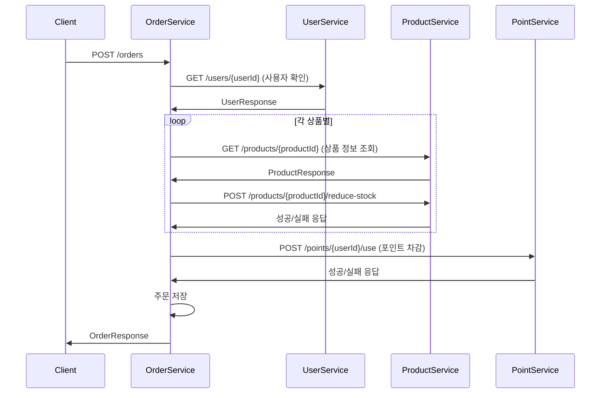
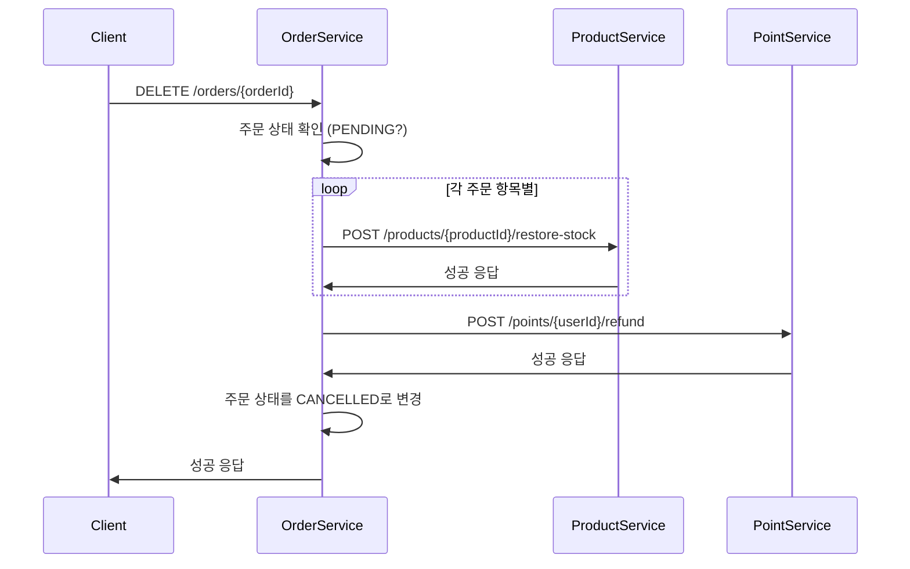

# API 설계 및 서비스 간 통신 플로우

## 🏗️ 서비스별 API 설계

### 📱 ProductService API

```http
# 상품 목록 조회
GET /products
Response: List<ProductResponse>

# 상품 상세 조회  
GET /products/{productId}
Response: ProductResponse

# 상품 등록 (관리자)
POST /products
Request: CreateProductRequest
Response: ProductResponse

# 상품 수정 (관리자)
PUT /products/{productId}
Request: UpdateProductRequest  
Response: ProductResponse

# 재고 차감 (내부 API)
POST /products/{productId}/reduce-stock
Request: { quantity: Integer }
Response: { success: Boolean }

# 재고 복원 (내부 API)
POST /products/{productId}/restore-stock
Request: { quantity: Integer }
Response: { success: Boolean }
```

### 👤 UserService API

```http
# 회원가입
POST /users/register
Request: RegisterRequest
Response: UserResponse

# 로그인
POST /users/login  
Request: LoginRequest
Response: LoginResponse

# 사용자 정보 조회 (내부 API)
GET /users/{userId}
Response: UserResponse
```

### 💰 PointService API

```http
# 포인트 조회
GET /points/{userId}
Response: PointResponse

# 포인트 충전
POST /points/{userId}/charge
Request: { amount: Integer }
Response: PointResponse

# 포인트 사용 (내부 API)
POST /points/{userId}/use
Request: { amount: Integer }
Response: { success: Boolean }

# 포인트 환불 (내부 API)  
POST /points/{userId}/refund
Request: { amount: Integer }
Response: { success: Boolean }
```

### 🛒 OrderService API

```http
# 주문 생성
POST /orders
Request: CreateOrderRequest
Response: OrderResponse

# 주문 목록 조회
GET /orders/users/{userId}
Response: List<OrderResponse>

# 주문 상세 조회
GET /orders/{orderId}
Response: OrderDetailResponse

# 주문 취소
DELETE /orders/{orderId}
Response: { success: Boolean }
```

---

## 📋 Request/Response DTO 정의

### ProductService DTOs

```java
// 상품 응답
public class ProductResponse {
    private Long id;
    private String name;
    private Integer price;
    private Integer stock;
}

// 상품 등록 요청
public class CreateProductRequest {
    private String name;
    private Integer price;
    private Integer stock;
}

// 상품 수정 요청
public class UpdateProductRequest {
    private String name;
    private Integer price;
    private Integer stock;
}
```

### UserService DTOs

```java
// 회원가입 요청
public class RegisterRequest {
    private String name;
    private String email;
    private String password;
}

// 로그인 요청
public class LoginRequest {
    private String email;
    private String password;
}

// 사용자 응답
public class UserResponse {
    private Long id;
    private String name;
    private String email;
}
```

### PointService DTOs

```java
// 포인트 응답
public class PointResponse {
    private Long userId;
    private Integer balance;
    private LocalDateTime lastUpdated;
}
```

### OrderService DTOs

```java
// 주문 생성 요청
public class CreateOrderRequest {
    private Long userId;
    private List<OrderItemRequest> orderItems;
}

public class OrderItemRequest {
    private Long productId;
    private Integer quantity;
}

// 주문 응답
public class OrderResponse {
    private Long id;
    private Long memberId;
    private Integer totalPrice;
    private OrderStatus status;
    private LocalDateTime orderDate;
}

// 주문 상세 응답
public class OrderDetailResponse {
    private Long id;
    private Long memberId;  
    private Integer totalPrice;
    private OrderStatus status;
    private LocalDateTime orderDate;
    private List<OrderItemResponse> orderItems;
}

public class OrderItemResponse {
    private Long productId;
    private String productName;
    private Integer productPrice;
    private Integer orderQuantity;
    private Integer totalPrice;
}
```

---

## 🔄 서비스 간 통신 플로우

### 1. **회원가입 플로우**



**FeignClient 구현:**
```java
// UserService의 PointServiceClient
@FeignClient(name = "point-service")
public interface PointServiceClient {
    @PostMapping("/points")
    void createPointAccount(@RequestBody CreatePointAccountRequest request);
}
```

### 2. **주문 생성 플로우**



**FeignClient 구현:**
```java
// OrderService의 FeignClient들
@FeignClient(name = "user-service")
public interface UserServiceClient {
    @GetMapping("/users/{userId}")
    UserResponse getUser(@PathVariable Long userId);
}

@FeignClient(name = "product-service") 
public interface ProductServiceClient {
    @GetMapping("/products/{productId}")
    ProductResponse getProduct(@PathVariable Long productId);
    
    @PostMapping("/products/{productId}/reduce-stock")
    ResponseEntity<Void> reduceStock(@PathVariable Long productId, @RequestBody ReduceStockRequest request);
    
    @PostMapping("/products/{productId}/restore-stock")
    ResponseEntity<Void> restoreStock(@PathVariable Long productId, @RequestBody RestoreStockRequest request);
}

@FeignClient(name = "point-service")
public interface PointServiceClient {
    @PostMapping("/points/{userId}/use")
    ResponseEntity<Void> usePoints(@PathVariable Long userId, @RequestBody UsePointsRequest request);
    
    @PostMapping("/points/{userId}/refund") 
    ResponseEntity<Void> refundPoints(@PathVariable Long userId, @RequestBody RefundPointsRequest request);
}
```

### 3. **주문 취소 플로우**



---

## 🚨 오류 처리 및 보상 트랜잭션

### 주문 생성 실패 시 보상 로직

```java
@Service
public class OrderService {
    
    public OrderResponse createOrder(CreateOrderRequest request) {
        List<Long> reducedProductIds = new ArrayList<>();
        boolean pointsDeducted = false;
        
        try {
            // 1. 사용자 확인
            UserResponse user = userServiceClient.getUser(request.getUserId());
            
            // 2. 각 상품 재고 차감
            for (OrderItemRequest item : request.getOrderItems()) {
                ProductResponse product = productServiceClient.getProduct(item.getProductId());
                productServiceClient.reduceStock(item.getProductId(), 
                    new ReduceStockRequest(item.getQuantity()));
                reducedProductIds.add(item.getProductId());
            }
            
            // 3. 포인트 차감
            int totalAmount = calculateTotalAmount(request.getOrderItems());
            pointServiceClient.usePoints(request.getUserId(), 
                new UsePointsRequest(totalAmount));
            pointsDeducted = true;
            
            // 4. 주문 저장
            Order order = createOrderEntity(request, user);
            orderRepository.save(order);
            
            return OrderResponse.from(order);
            
        } catch (Exception e) {
            // 보상 트랜잭션 실행
            compensate(request.getUserId(), reducedProductIds, pointsDeducted);
            throw new OrderCreationException("주문 생성에 실패했습니다.", e);
        }
    }
    
    private void compensate(Long userId, List<Long> reducedProductIds, boolean pointsDeducted) {
        // 차감된 재고 복원
        for (Long productId : reducedProductIds) {
            try {
                // 원래 차감한 수량만큼 복원 (별도 저장 필요)
                productServiceClient.restoreStock(productId, new RestoreStockRequest(quantity));
            } catch (Exception e) {
                log.error("재고 복원 실패: productId={}", productId, e);
            }
        }
        
        // 차감된 포인트 환불
        if (pointsDeducted) {
            try {
                pointServiceClient.refundPoints(userId, new RefundPointsRequest(totalAmount));
            } catch (Exception e) {
                log.error("포인트 환불 실패: userId={}", userId, e);
            }
        }
    }
}
```

---

## 🔧 내부 API vs 외부 API 구분

**외부 API (Client 접근)**
- 인증/인가 검증 필요
- 상세한 응답 정보 포함
- Rate Limiting 적용

**내부 API (서비스 간 통신)**
- 서비스 간 인증만 필요
- 필수 정보만 포함하여 성능 최적화
- Circuit Breaker 패턴 적용